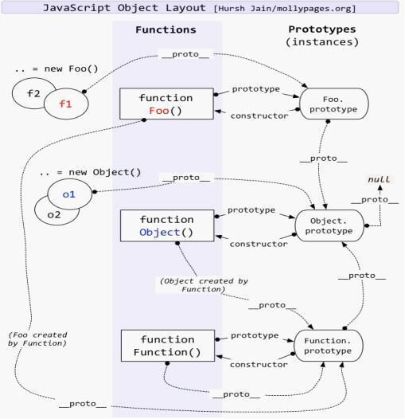

# 微服务

## 什么是服务

- 服务是指在计算机领域中，为其他软件或系统提供特定功能或服务的程序或组件。服务可以是独立运行的软件模块，也可以是运行在分布式系统中的网络服务。

## 什么是 RPC

- RPC（Remote Procedure Call，远程过程调用）是一种通信协议，用于不同计算机之间的进程间通信。它允许一个计算机程序调用另一个计算机上的子程序，而不需要程序员显式地处理底层网络细节。

## 什么是微服务

- 微服务是一种架构风格，将一个大型的应用程序拆分成一组小型、独立的服务。每个服务都运行在自己的进程中，并通过轻量级的通信机制（如 RPC）进行通信。每个微服务都专注于完成特定的业务功能，并可以独立部署、扩展和维护。

## 微服务为什么要通过 rpc 通信而不是通过发送 http 请求的方式来进行通信

- 根本原因是性能问题：
  - 在微服务架构中，每个服务都是一个独立的进程，服务之间需要通过网络进行通信。 由于微服务架构中服务数量较多，服务之间的通信量也会很大。 如果使用 HTTP 协议，每次请求都需要建立和断开连接，这会造成很大的性能开销。 而 RPC 协议可以使用连接池等技术来减少连接建立和断开的开销，提高性能
  - 高效性
    - RPC 通常比 HTTP 请求更高效。RPC 框架通使用二进制协议进行数据传输，而不是像 HTTP 一样使用文本协议。这味着在序列化和反序列化数据时，RPC 可以更快地处理数据。此外，RPC 框架还可以使用更高效的网络传输协议，如 gRPC 使用的 Protocol Buff，从而提供更好的性能。
  - 强类型约定
    - RPC 框架通常使用强类型约定来定义服务接口和消息格式。这使得在编译时就能够发现潜在错误，并提供更好的代码提示和动补全功能。比之下，HTTP 请求是基于文本的，没有明确的接口定义和类型约束，容易出现人为错误。
  - 安全性
    - RPC 框架通常支持安全的通信机制，如 TLS/SSL 加密和身份验证。这对保护敏感数据和防止未经授权的访问非常重要。
  - 更丰富的功能
    - RPC 框架通常提了更丰富功能和特性，如服务发现、负载衡、故障复等。这些功能可以帮开发者更轻松构建可靠和扩展的微服务架构。

# 源码

## vue

### vue3 keep-alive 原理

- keep-alive 组件的实现采用了 LRU（Least Recently Used，最近最少使用）算法
  - 命中缓存，则直接返回缓存，同时更新缓存 key 的位置
  - 不命中缓存则设置进缓存，同时检查缓存的实例数量是否超过 max
  - 核心思想是“如果数据最近被访问过，那么将来被访问的几率也更高”

### nexttick 原理

- nextTick 是 Vue 提供的一个异步方法，用于在下次 DOM 更新循环结束之后执行回调函数。它的原理是利用 JavaScript 的事件循环机制，将回调函数推入一个队列中，在下一个事件循环中执行。具体来说，当调用 nextTick 时，Vue 会先检查是否支持 Promise 对象，如果支持，则使用 Promise 的 then 方法将回调函数推入微任务队列中；如果不支持 Promise，则使用 MutationObserver 监听 DOM 变化，在 DOM 更新循环结束后执行回调函数；如果都不支持，则使用 setTimeout 将回调函数推入宏任务队列中，在下一个事件循环中执行。

### 如何实现模板编译

- Vue 的模板编译是将模板字符串转换为渲染函数的过程。具体实现步骤如下：
  - 解析模板字符串，生成抽象语法树（AST）。
  - 遍历 AST，对每个节点进行静态标记，判断节点是否为静态节点（即不依赖响应式数据的节点）。
  - 遍历 优化之后的 AST，对每个节点进行代码生成，生成渲染函数的字符串形式。
- render 函数用于生成 vnode，然后通过 diff 比较变换，渲染到页面上

### 最小版本响应式系统

# http

### TLS/SSL

- TLS 是 SSL 的更安全、更高效的版本
- 在握手过程中，客户端和服务器之间进行了身份验证、密钥交换和协商加密算法等操作，以确保安全通信的建立。握手过程完成后，双方可以开始安全地传输数据。
- 握手流程/工作流程
  - 客户端发起连接请求：客户端向服务器发送一个连接请求，请求建立一个安全通道。
  - 服务器回应：服务器收到连接请求后，向客户端发送一个回应，包含服务器的数字证书和一些其他信息。
  - 客户端验证证书：客户端收到服务器的回应后，会验证服务器的数字证书的有效性。这包括检查证书的签名是否有效、证书是否过期以及证书是否与服务器的域名匹配。。
  - 客户端生成密钥：如果服务器的证书有效，客户端会生成一个用于加密通信的随机对称密钥，并使用服务器的公钥进行加密。
  - 服务器解密密钥：服务器使用自己的私钥解密客户端发送的加密密钥。
  - 握手完成：客户端和服务器现在都拥有了相同的对称密钥，用于加密和解密通信。握手过程完成后，安全通道建立。

### 常见状态码

- 1xx（临时响应）
  - 100 继续
  - 101 切换协议
- 2xx （成功）

  - 201 已创建
  - 202 已接受
  - 203 非授权
  - 204 无内容
  - 205 重置内容
  - 206 部分内容

- 3xx （重定向）

  - 300 多种选择
  - 301 永久移动
  - 302 临时移动
  - 303 查看其它位置
  - 304 未修改 协商缓存
    - 不会返回内容
  - 305 使用代理
  - 307 临时重定向

- 4xx（请求错误）

  - 400 错误请求
  - 401 未授权
  - 403 禁止
  - 404 未找到
  - 405 方法禁用
  - 406 不接受
  - 407 需要代理授权
  - 408 请求超时
  - 409 冲突
  - 410 已删除
  - 411 需要有效长度
  - 412 未满足前提条件
  - 413 请求实体过大
  - 414 请求的 URI 过长
  - 415 不支持的媒体类型
  - 416 请求范围不符合要求
  - 417 未满足期望值

- 5xx（服务器错误）
  - 501 尚未实施
  - 502 错误网关
  - 503 服务不可用
  - 504 网关超时
  - 505 HTTP 版本不受支持

### ip

#### dns

- dns 是一种用于将域名转换为 IP 地址的分布式命名系统。它充当了互联网上的电话簿，将易于记忆的域名（如www.example.com）映射到对应的 IP 地址（如 192.0.2.1）。
- 流程:
  - 1.输入 url
  - 2.操作系统的网络栈接收到该请求，并检查本地 DNS 缓存中是否有对应的 IP 地址。如果有，直接返回给浏览器；如果没有，继续下一步。
  - 3.操作系统向预配置的 DNS 服务器发送一个 DNS 查询请求，通常是本地 ISP（互联网服务提供商）的 DNS 服务器。
  - 4.DNS 服务器接收到查询请求后，首先检查自己的缓存中是否有对应的 IP 地址。如果有，直接返回给操作系统；如果没有，继续下一步。
  - 5.DNS 服务器向根域名服务器发送一个迭代查询请求，询问该域名的顶级域名服务器的 IP 地址。
  - 6.根域名服务器返回顶级域名服务器的 IP 地址给 DNS 服务器。
  - 7.DNS 服务器向顶级域名服务器发送一个迭代查询请求，询问该域名的权威域名服务器的 IP 地址。
  - 8.权威域名服务器返回该域名的 IP 地址给 DNS 服务器。
  - 9.DNS 服务器将该 IP 地址返回给操作系统。
  - 10.操作系统将 IP 地址返回给浏览器。
  - 11.浏览器使用该 IP 地址与服务器建立连接，并发送 HTTP 请求。

#### icmp

- ICMP（Internet Control Message Protocol）是一种用于在 IP 网络上传递控制消息的协议。它通常用于网络故障排除、错误报告和网络状况监测。

### post 与 get 的区别

- RPC 规范

  - POST 方法用于向服务器提交数据，通常用于创建、更新或删除资源。它在请求体中传输数据，并且可以包含复杂的数据结构。
  - GET 方法用于从服务器获取数据，通常用于读取资源。它将参数附加在 URL 的查询字符串中，以便将请求参数传递给服务器。

- 根据 RPC 规范区别如下
  - POST 方法的请求不会被缓存，因为每次请求都可能对服务器状态进行更改，GET 方法的请求可以被缓存，因为它们通常只用于获取数据，不对服务器状态进行更改。如果请求的 URL 和参数与之前的请求相同，则可以使用缓存的响应。
  - POST 方法没有限制请求的大小，可以传输大量数据。
  - GET 方法有 URL 长度限制【RPC 本身没限制】，不同的浏览器和服务器对 URL 长度的限制不同，通常在几千个字符左右。
  - POST 方法的请求对数据的传输更加安全，因为请求的数据包含在请求体中，不会暴露在 URL 中。这对于传输敏感信息非常重要。其实也不安全，抓包就看见了，想要安全必须 https
  - GET 方法的请求将参数暴露在 URL 中，因此不适合传输敏感信息。URL 中的参数可能会被浏览器、代理服务器或日志记录器记录下来。
  - get 在浏览器回退时无害，post 会再次提交请求

# GraphQL

## 如何缓存

## N+1 问题解决方案

- 是什么
- dataLoader
  - dataLoader 为什么可以解决 graphql 的 n+1 问题的

# node 与 nest

## 说说对 Node 中的 process 的理解？有哪些常用方法？

## 说说对 Node 中的 fs 模块的理解? 有哪些常用方法

## 说说对 Node 中的 Buffer 的理解？应用场景？

## 说说对 Node 中的 Stream 的理解？应用场景？

## 说说 Node 中的 EventEmitter? 如何实现一个 EventEmitter?

## 讲一下 Babel 的原理，讲一下 AST 抽象语法树

## 说说对 Nodejs 中的事件循环机制理解?

### 内存管理

- 不管什么编程语言，内存生命基本都是一致的
  - 1.分配需要的内存空间
  - 2.使用内存【读写】
  - 3.释放内存

#### JS 的内存管理

- js 我们创建的变量，系统会自动给悐分配对应的内存，当系统发现这些变量不在被使用的时候，就会自动释放。
- js 中数据分为基本数据类型和引用数据类型

  - 基本数据类型存放在栈中，按值访问。有操作系统来自动分配和自动释放
  - 引用数据类型存放在堆中，按引用访问。由于大小不固定，系统无法进行自动释放，js 引擎来释放内存

- 为什么需要垃圾回收
  - 栈内的内存，操作系统会自动进行内存分配和内存释放，而堆中的内存，由 JS 引擎手动进行释放，当我们的代码没有按照正确的写法时，会使得 JS 引擎的垃圾回收机制无法正确的对内存进行释放（内存泄露），从而使得浏览器占用的内存不断增加，进而导致 JavaScript 和应用、操作系统性能下降。
  - 在 Chrome 中，v8 被限制了内存的使用（64 位约 1.4G/1464MB ， 32 位约 0.7G/732MB），为什么要限制呢？
    - 表层原因 v8 当初是为浏览器设计的，不太可能遇到大内存的场景
    - 深层原因 v8 垃圾回收机制的限制，清理大量的内存会非常耗时，会导致 JavaScript 线程暂停执行

#### Chrome 垃圾回收算法

- 为了提高回收效率，V8 将堆分为两类新生代和老生代，新生代中存放的是生存时间短的对象，老生代中存放的生存时间久的对象。

  - 副垃圾回收器:主要负责新生代
  - 主垃圾回收器:主要负责老生代

- 新生态垃圾回收器

  - scavenge 算法【复制算法，时间换空间】

    - 标记活动对象和非活动东西
    - 复制 from space 的活动对象到 to space 中
    - 释放 from space 的非活动对象的内存
    - 将 from space 和 to space 角色互换

  - 新生代中的对象什么时候变成老生代的对象呢？

    - 在新生代中，还进一步进行了细分，分为 nursery 子代和 intermediate 子代两个区域，一个对象第一次分配内存时会被分配到新生代中的 nursery 子代，如果进过下一次垃圾回收这个对象还存在新生代中，这时候我们移动到 intermediate 子代，再经过下一次垃圾回收，如果这个对象还在新生代中，副垃圾回收器会将该对象移动到老生代中，这个移动的过程被称为晋升。

  - 垃圾回收器是怎么知道哪些对象是活动对象和非活动对象的呢
    - 从初始的根对象（window，global）的指针开始，这个根指针对象被称为根集（root set），从这个根集向下搜索其子节点，被搜索到的子节点说明该节点的引用对象可达，并为其留下标记，然后递归这个搜索的过程，直到所有子节点都被遍历结束，那么没有被标记的对象节点，说明该对象没有被任何地方引用，可以证明这是一个需要被释放内存的对象，可以被垃圾回收器回收。

- 老生代垃圾回收器
  - 全停顿 Stop-The-World
    - Mark-Compact 算法在执行过程中需要移动对象，而当活动对象较多的时候，它的执行速度不可能很快，为了避免 JavaScript 应用逻辑和垃圾回收器的内存资源竞争导致的不一致性问题，垃圾回收器会将 JavaScript 应用暂停，这个过程，被称为全停顿（stop-the-world）。
  - Mark-Sweep（标记清除） 和 Mark-Compact（标记整理） 算法
    - 标记阶段：对老生代进行第一次扫描，标记活动对象
    - 清理阶段：对老生代进行第二次扫描，清理未标记对象，既然清理非活动对象
    - 优化：标记清除之后老生代的内存中产生了很多内存碎片，提了解决这个问题，标记整理应运而生。
      - Mark-Compact 添加了活动对象整理阶段，将所有的活动对象往一端移动，移动完成后，直接清理掉边界外的内存

## 讲一下浏览器的渲染流程

## 讲一下浏览器多进程的渲染优势

## 谈谈你对浏览器架构的理解

# webpack

## 讲一下 webpack 的打包原理

## webpack 的理解

## 讲一下 webpack5 的模块联邦

## webpack 构建流程

## loader 与 plugin 区别

## 编写 Loader，Plugin 的思路？

## 如何借助 webpack 来优化前端性能？

## 如何提高 webpack 的构建速度？

## webpack vs vite vs rollup

## 说说 webpack proxy 工作原理？为什么能解决跨域?

# css

## 盒模型

- 标准盒模型
  - 内容宽度 = content
- ie 盒模型

  - 内容宽度= content + border + padding

- box-sizing
  - content-box
    - 标准盒模型
  - border-box
    - ie 盒模型

## CSS 选择器有哪些？哪些属性可以继承？

## CSS 优先级算法如何计算

## 如何居中 div？如何居中⼀个浮动元素？如何让绝对定位的 div 居中？

## bfc

## 隐藏元素

# http

## 什么是强缓存

## 什么是协商缓存

# 其它

## axios 源码分析

## 说说你对 spa 的理解

- spa 其实很早之前就有了，比如 jq 时期的 backbone，不过当时由于 seo 等原因并不流行。后面随着 react、vue 的出现渐渐成为了主流
- spa 与 mpa 的区别，mpa 的每个页面都是一个主页面，都是独立的当我们在访问另一个页面的时候，都需要重新加载 html、css、js 文件。当然 mpa 不存在 seo 的问题，spa 首次渲染比较慢，spa 是局部刷新，mpa 为整页刷新。spa 路由可以是 hash / histroy，而 mpa 只能是 history。切换

## vue2 vs vue3

- 全量的 diff -> 根据 patchFlag 做 diff + 最长递增子序列
- flow -> ts
- -> monorepo 的代码管理方式（pnpm）
- Fragment 支持多个根节点
- options api -> composition api
- 自定义渲染器 createRenderer() 传入自己的渲染方法， 好处就是我可以根据 vue 核心来实现不同平台的代码
- 响应式

  - vue2
    - 1.创建 vue 实例
    - 2.对 data 定义的数据调用 observe 方法目的是将数据都变成响应式
    - 3.observe 具体逻辑为，通过 Object.prototype 对 data 进行数据劫持【数组采用了数据劫持】，再 get 收集依赖，具体来说收集的是 watcher，将 watcher 放进 dep 的数组中在代码中就是将 dep.target 的值 push 到 dep 中，dep 是一个 class 用来维护数组提供一些方法比如 notify 便利 dep 数组然后执行里面的 update 函数。在 set 中调用 dep 的 notify 方法
    - 4.watcher 是一个 class 具体是将实例 this 赋值给 dep.target。而这个 this 其实就是 vue 组件也就是虚拟 dom
    - 5.模板编译：通过词法分析生产一个一个 tokens。然后通过语法解析将 tokens 生产 ast，优化 ast 将静态节点打上 tag，便于后面 diff 的时候直接忽略，然后生成 render 函数。也就是 this 也就是每一个组件的 render 函数会放到 dep 中
    - 6.调用 render 函数【比如出发 set】，生成虚拟 dom，如果没有旧节点就直接跳过 diff 直接调用 dom 的 api 渲染到页面上，如果有旧 diff 则找到差异，然后将差异渲染到实际的 dom 上
  - vue3

    - 宏观来说，vue3 响应式主要是通过 proxy 进行数据劫持，如果读取数据则将副作用函数从桶中取出，设置则往桶里放。通过 weakmap+map 构建了桶结构
    - 一些 case

      - 分支切换问题
      - 设置代理对象不存在的属性的时候不应该触发 effect
      - 调用多个 effect
      - effect 嵌套
      - new Set 循环

    - 最外层有个 activeEffect 对象标识当前的 effect，还有个 weakMap 对象 主要是用于存储响应式对象的依赖关系，大概格式为里面包裹着 Map。Map 里面包括则 set，而 set 里面装着 activeEffect
      - 为什么要这么设计呢
        - 如果只是一个简单的 set 类型，当向代理对象添加不存在的对象时候，也会触发 effect。而不是根据 effect 里面依赖谁所以将数据结构改成了下面这样
        - 当访问一个代理对象的时候，会存在 3 部分
          - weakmap->map->set
          - 被操作【读取】的代理对象
          - 被操作【读取】的字段名
          - 副作用函数 effect

    ```
     weakmap{
      map{
        set[effect,effct]
      }
     }

    ```

    - reactive
      - ES6 Proxy 来拦截对响应对象的访问和修改操作
      - get 收集依赖核心逻辑为 track
      - set 触发依赖核心逻辑为 trigger
    - track
    - trigger
    - effect
    - run
      - 核心逻辑
    - stop

    ```js
    const stack = new WeakMap();
    let activeEffect;
    const data = { text: "123" };
    const obj = new Proxy(data, {
      get(target, key) {
        track(target, key);
        return target[key];
      },
      set(target, key, newVal) {
        target[key] = newVal;
        trigger(target, key);
      },
    });
    function track(target, key) {
      let depMap = stack.get(target);
      if (!depMap) {
        stack.set(target, (depMap = new Map()));
      }
      let deps = depMap.get(key);
      if (!deps) {
        depMap.set(key, (deps = new Set()));
      }
      deps.add(activeEffect);
    }
    function trigger(target, key) {
      const depMap = stack.get(target);
      if (!depMap) return;
      const effects = depMap.get(key);
      effects && effects.forEach((fn) => fn());
    }
    function effect(fn) {
      activeEffect = fn;
      fn();
    }
    effect(() => {
      console.log("effet render");
      document.body.innerHTML = obj.text;
    });
    setTimeout(() => {
      console.log(1);
      obj.text = "hellow world";
    }, 1000);
    ```

## vue vs react

- 架构层面
- 生态
  - vue 比较统一
  - react 的选择
- 使用体验
- 底层原理
  - diff
  - 双向数据绑定
  - 单向数据流
- 个人体验

## typeof 与 instanceof 区别

## 为什么箭头函数没有 prototype，但是其原型却指向 Function.prototype

- 由于箭头函数没有自己的 prototype 属性，所以也不能通过箭函数来创建对象实例,在 JavaScript 中，所有的函数都是 Function 对象的实例，包括箭头函数。

## == 与 === 区别

- "==" 运算符是相等算符，用比较两个值是否相等。它会进行类型转换，然后再较值。如果两个值的类型不同它会尝试将它们转换为相同类型，然后再进行比较使用"===" 运算符可以更确地比较两个值是否相等，而不会受到类型转换的影响

## 类型转换机制

## this 的理解

## js 事件模型

## new 原理

- 创建一个空对象
  - `var obj = {}`
- 将新对象的原型指向构造函数的原型对象上
  - `obj.__proto__ = 构造函数.prototype`
- 将构造函数的 this 指向新对象
  - `var fn = 构造函数.bind(this)`
- 执行构造函数内部的代码
  - `var result = fn(...args)`
- 如果构造函数返回的不是对象则返回新对象
  - `typeof result == 'object'?result:obj`

```js
function miniNew(constructor, ...args) {
  const obj = Object.create(constructor.prototype);
  const result = constructor.applty(obj, ...args);
  return typeof result == "object" ? result : obj;
}
```

## Object.create 的 polyfill

```js
function miniObjectCreate(proto) {
  function F() {}
  F.prototype = proto;
  return new F();
}
```

## Object.setPrototypeOf 的 polyfill

```js
function setPrototypeOf(obj, proto) {
  obj.__proto__ = proto;
  return obj;
}
```

## 为什么 Function.prototype == Function.**proto**为 true

- Function.prototype 和 Function.**proto**都是指向同一个对象，即 Function 函数的原型对象。这是因为在 JavaScript 中，每个函数都是由 Function 构造函数创建的，而 Function 构造函数本身也是一个函数对象。因此，Function.prototype 指向的是 Function 函数的原型对象，而 Function.**proto**指向的是 Function 函数自身的原型对象。

## 控制并发请求

```js
async function concurrentRequest(urls, maxConcurrent, callback) {
  const results = [];
  const queue = []; // 队列用于存放待执行的请求
  let currentCount = 0;
  let index = 0;
  async function request(url, idx) {
    currentCount++;
    console.log(`Sending request to ${url} (Concurrent: ${currentCount})`);
    const result = await new Promise((resolve, reject) => {
      setTimeout(() => {
        index++;
        const result = `Response from ${url}`;
        currentCount--;
        results[idx] = result; // 将结果存储在正确的索引位置
        resolve(result);
      }, 5000);
    });
    return result;
  }

  async function run() {
    while (queue.length > 0) {
      const { url, idx } = queue.shift(); // 从队列中取出一个请求
      await request(url, idx); // 等待请求完成
      if (index === urls.length) {
        callback(results);
      }
    }
  }

  urls.forEach((url, idx) => {
    queue.push({ url, idx }); // 将请求加入队列
  });

  // 同时执行不超过 maxConcurrent 个任务
  for (let i = 0; i < maxConcurrent; i++) {
    run();
  }
}

// 示例数据
const urls = ["url1", "url2", "url3", "url4", "url5"];
concurrentRequest(urls, 2, (results) => {
  console.log("All requests completed:");
  console.log(results);
});
```

## bind call apply 原理

## ajax/fetch/axios 原理

- 如何取消发送的请求

## 内存泄漏的场景

### 意外的全局变量

```js
function foo(arg) {
  bar = "this is a hidden global variable";
}

function foo() {
  this.variable = "potential accidental global";
}
// foo 调用自己，this 指向了全局对象（window）
foo();
```

### 定时器未清理

```js
var someResource = getData();
setInterval(function() {
    var node = document.getElementById('Node');
    if(node) {
        // 处理 node 和 someResource
        node.innerHTML = JSON.stringify(someResource));
    }
}, 1000);
```

### 闭包

```js
function bindEvent() {
  var obj = document.createElement("XXX");
  var unused = function () {
    console.log(obj, "闭包内引用obj obj不会被释放");
  };
  obj = null; // 解决方法
}
```

### 没有清理对 DOM 元素的引用同样造成内存泄露

```js
const refA = document.getElementById("refA");
document.body.removeChild(refA); // dom删除了
console.log(refA, "refA"); // 但是还存在引用能console出整个div 没有被回收
refA = null;
console.log(refA, "refA"); // 解除引用
```

## 本地存储

## 详细说明 Event loop

- 痛点:JavaScript 是一门单线程的编程语言，意味着它一次只能执行一个任务。在 Web 开发中，JavaScript 常用于处理用户交互、网络请求和异步操作等任务。如果没有 Event Loop，当遇到耗时的任务时，JavaScript 将会被阻塞，导致页面无法响应用户的操作，用户体验变差

- 是什么:Event Loop 的出现解决了这个问题。它是一种机制，用于协调和管理 JavaScript 运行时的任务队列，确保任务按照正确的顺序执行，同时保持页面的响应性。Event Loop 的主要作用是将任务分为微任务和宏任务，并按照一定的规则执行它们。
- 执行流程:
  - 根据 whatwg 规范简化版本:
    - 1.从宏任务队列【例如 script/整个 js 的脚本/】中出队【dequeue】并执行最早的任务,但是规范有说明其实不是队列还是用 set 添加。
    - 2.检查微任务队列，如果有微任务，则依次执行所有微任务，直到微任务队列为空。
    - 3.更新渲染，如果需要重新渲染页面。
    - 4.执行宏任务，从宏任务队列中取出一个任务执行。如果宏任务队列为空，则休眠直到出现宏任务。
    - 5.跳转到第 1 步
- 常见的宏任务
  - setTimeout
  - setInterval
  - I/O 操作
  - requestAnimationFrame
  - UI 交互回调函数【点击、键盘】
- 常见的微服务
  - Promise
  - MutationObserver
  - process.nextTick【node】
- 注意：
  - 在同一个事件循环中，微任务会在宏任务之前执行完毕。这意味着微任务可以在下一个宏任务之前更新页面状态，从而提供更好的用户体验。

## fp 的优缺点，与 oop 有何区别

- js 数组方法 map、filter、reduce、every、some 都属于纯函数
- 数据和状态：函数式编程使用不可变数据，强调避免共享状态和副作用。而面向对象编程使用可变对象和状态，并通过对象之间的交互来实现功能。
- 避免副作用：函数式编程避免使用副作用，即函数不会改变外部状态或修改传入的参数。相反，函数式编程鼓励使用纯函数，即给定相同的输入，总是返回相同的输出，而不依赖于外部状态。
- 函数式编程通过将多个函数组合在一起来处理数据。每个函数都接受输入并返回输出，而不会修改输入数据。通过将多个函数组合在一起，可以实现复杂的数据转换，而不会改变原始数据。

## 函数缓存

- lodash memoize 函数

```js
function memoize(func) {
  const cache = {};
  return (...args) => {
    const key = JSON.stringify(args);
    if (cache[key]) {
      return cache[key];
    }
    const res = func.apply(this, args);
    cache[key] = res;
    return res;
  };
}

function expensiveOperation(n) {
  console.log("Executing expensive operation...");
  // 假设这里有一个耗时的计算
  return n * 2;
}

const memoizedExpensiveOperation = memoize(expensiveOperation);

console.log(memoizedExpensiveOperation(5)); // 第一次调用，执行expensiveOperation函数
console.log(memoizedExpensiveOperation(5)); // 直接返回缓存的结果
console.log(memoizedExpensiveOperation(10)); // 第一次调用，执行expensiveOperation函数
```

## 防抖与节流

### 防抖 Debounce

- 防抖是指在事件触发后，等待一段时间后再执行相应的操作。如果在等待时间内再次触发了该事件，那么等待时间会重新计时。防抖常用于处理频繁触发的事件，例如窗口大小改变、搜索框输入等。
- 场景：在搜索框输入时，可以使用防抖来延迟发送请求，减少不必要的网络请求

```js
function debounce(func, delay) {
  let timer;
  return (...args) => {
    clearTimeout(timer);
    timer = setTimeout(() => {
      func.apply(this, args);
    }, delay);
  };
}
```

### 节流 Throttle

- 节流是指在一定时间间隔内只执行一次操作。如果在该时间间隔内多次触发了该事件，只有第一次触发会执行相应的操作，后续触发会被忽略。节流常用于处理高频率触发的事件，例如滚动事件、鼠标移动事件等。
- 场景：在滚动页面时，可以使用节流来限制触发滚动事件的频率，减少页面的重绘次数。

```js
function throttle(func, delay) {
  let lock = false;
  return (...args) => {
    if (!lock) {
      func.apply(this, args);
      lock = true;
      setTimeout(() => {
        lock = false;
      }, delay);
    }
  };
}
```

## 浏览器渲染

### 浏览器渲染大体上分为以下五步

- 1.处理 html 生成 DOM tree（Document Object Model）
- （浏览器把得到的 html 代码转换为一个 DOM 树，我们 html 文档中的每一个 tag 标签都是一个 DOM 树的节点（文本节点也是） DOM 树的根节点就是我们的 document 对象，这里要注意，我们用 js 动态生成的 DOM 节点也在 DOM 树上）
- 2.处理 css 生成 CSSOM（CSS Object Model） Tree（浏览器会把所有的样式解析为样式结构体（包括 css 样式和浏览器默认样式），当然浏览器识别不了的样式不能解析，最后生成了 CSSOM 树）
- 3.DOM 树与 CSS-DOM 树合并为 Render 树 （Render 树我们叫它渲染树。它是由 DOM 树和 CSSOM 树合成的，渲染树的每一个节点都有自己的 style 样式，渲染树上没有隐藏的节点，比如 display：block 和无样式 head 节点，因为这些节点不会呈现也不影响呈现）
- 4.对 Render 树进行布局计算（在这个阶段会根据 Render 树的样式计算布局，输出的结果称为 box 盒模型（布局计算完成后，浏览器就知道了每个盒子在页面中的准确位置和大小，为下一步的绘制提供了准确的信息。绘制阶段会根据布局计算的结果，将渲染树中的每个节点绘制到屏幕上的每个像素点上，最终呈现给用户。）
- 5.遍历 Render 树的每一个节点绘制到屏幕（最后将信息渲染到屏幕中每一个真实的像素点
  这个过程叫绘制或者 rasterizing 格栅化）

## 重绘与重排

- 重排必定会引发重绘，但重绘不一定会引发重排

### 重排

- 触发重绘的条件：页面布局和元素几何属性的改变就会导致重排
  - 页面初始渲染
  - 添加/删除可见 dom
  - 改变元素位置
  - 改变元素尺寸（宽、高、内外边距、边框等）
  - 改变元素内容（文本或图片等）
  - 改变窗口尺寸
- 当 DOM 变化影响了元素的几何属性（宽、高改变等等），浏览器此时需要重新计算元素几何属性，并且页面中其他元素的几何属性可能会受影响，这样渲染树就发生了改变，也就是重新构造 RenderTree 渲染树，这个过程叫做重排（reflow）

### 重绘

- 如果 DOM 变化仅仅影响的了背景色等等非几何属性，此时就发生了重绘（repaint）而不是重排，因为布局没有发生改变
- 触发重绘的条件：改变元素外观属性。如：color，background-color 等。

### 优化重排与重绘

- 浏览器自己的优化：浏览器会维护 1 个队列，把所有会引起回流、重绘的操作放入这个队列，等队列中的操作到了一定的数量或者到了一定的时间间隔，浏览器就会 flush 队列，进行一个批处理。这样就会让多次的回流、重绘变成一次回流重绘
- 减少重绘和重排就是要减少对渲染树的操作，则我们可以合并多次的 DOM 和样式的修改。并减少对 style 样式的请求
- 直接改变元素的 className
- display：none；先设置元素为 display：none；然后进行页面布局等操作；设置完成后，元素设置为 display：block；这样的话就只引发两次重绘和重排【元素隐藏期间不会影响页面布局，只有在元素重新显示时才会触发一次重排和重绘。这样的操作可以减少不必要的重排和重绘，提高页面性能。】
- 使用 cloneNode(true or false) 和 replaceChild 技术，引发一次回流和重绘
- 将需要多次重排的元素，position 属性设为 absolute 或 fixed，元素脱离了文档流，它的变化不会影响到其他元素
- 如果需要创建多个 DOM 节点，可以使用 DocumentFragment 创建完后一次性的加入 document；
- 尽量不要使用 table 布局

## 如何判断一个元素是否再可视化区

## 大文件上传如何做断点续传

## 什么是单点登录

## 平时的工作中你有做过什么性能优化

- 首先性能优化不同的项目优化的手段是不一样的，不过所有优化手段无碍乎 2 点：
  - 减少包体积【b/s 架构】
  - 能缓存的地方缓存
- 具体方案
  - 减少包体积
    - 精灵图
    - 代码分割
  - 缓存
    - 接口缓存
    - 计算结构缓存
    - 不可变数据持久化
  - 框架
    - tree sharing
    - ssr
    - 异步组件

# JS

## 什么是闭包

- 为什么会产生闭包【背景】：JavaScript 的函数是一等公民，可以作为参数传递，也可以作为返回值。这就导致了一个问题，当一个函数在其定义环境之外被调用时，如何访问其原始环境的变量？这就是闭包出现的背景。闭包的出现，解决了函数与其定义环境的变量之间的关联问题。
- 是什么：
  - 关于闭包社区对此众说纷纭，MDN 给出的定义是：`闭包是指那些能够访问自由变量的函数。` 自由变量是指在函数中使用的，但既不是函数参数也不是函数的局部变量的外部变量【不能是全局对象，因为全局对象不满足外部变量的条件，其再内部就可以访问】。
- 特性：
  - 函数嵌套：闭包是由函数和与其相关的引用环境组合而成的实体。JavaScript 中的闭包存在于嵌套的内部函数中。
  - 访问外部变量：闭包可以访问和操作其外部函数的变量。
  - 保存状态：闭包可以用来保存状态，即使外部函数已经退出，闭包仍然可以访问和修改这些变量。
  - 内存消耗：虽然闭包有很多优点，但是由于闭包会使得函数中的变量都保存在内存中，过度使用闭包可能会导致内存消耗过大。
- 用途
  - 模拟私有方法：JavaScript 本身不支持私有方法，但是我们可以使用闭包来模拟私有方法。
  - 创建特权方法：可以使用闭包来创建能够访问私有变量的公有方法，这些公有方法被称为特权方法。
  - 实现数据隐藏和封装：闭包可以帮助我们隐藏不应该被直接访问的数据，实现封装。
  - 实现函数柯里化：闭包可以用来实现函数柯里化，即创建已经设置了一个或多个参数的函数。
  - 创建块级作用域：在 ES6 之前，JavaScript 没有块级作用域，但我们可以使用闭包来模拟块级作用域。

## 什么是原型

- 概念
  - 构造函数的每个实例都有一个 `__proto__ `指针，它指向构造函数的 prototype 对象。prototype 对象包含了通过该构造函数创建的实例所共享的属性和方法
- 用途
  - 继承：通过原型链，对象可以继承其原型对象的属性和方法。这使得代码可以更好地组织和重用，避免了重复编写相似的代码。
  - 属性和方法的共享：原型对象中的属性和方法可以被所有基于该原型创建的对象共享。这意味着可以在一个地方定义属性和方法，然后所有相关的对象都可以访问和使用它们。
  - 动态性：原型链是动态的，可以在运行时动态地修改和扩展对象的原型，从而影响到所有基于该原型创建的对象。这种动态性使得 JavaScript 具有很高的灵活性和可扩展性。

## 什么是原理链

- 
- 对比 java 原型链的区别：
  - 与 java 这种类继承机制不同：
    - js 的原型链非常灵活，它运行对象可以再运行时动态 crud 属性方法
    - 可以通过原型链共享方法和属性。当多个对象共享相同的原型时，它们可以共享相同的方法和属性，从而节省内存空间
    - 原型链允许对象在运行时继承其他对象的属性和方法。这意味着对象可以在不预先定义类的情况下进行继承，从而提供更大的灵活性
- 作用：它使得对象之间可以共享属性和方法，提高了代码的复用性
- 当查找一个对象的属性或者方法的时候，首先会从自身开始查找，如果在当前对象的原型上找不到所需的属性或方法，就会继续在原型的原型上进行查找，直到最终在原型链的顶端（Object 的 prototype 为 null）找到或者遍历完整个原型链。这样的查找过程被称为原型链。

## 继承有哪些，每一种的优缺点

- class
- 原型链
- 组合
- 组合寄生
- 构造函数

## 说说 JavaScript 中的数据类型？存储上的差别？

# ES6

## ES6 中数组新增了哪些扩展

- `Polyfill 的话可以参考 core-js`
- Array.from

  - feature
    - 返回一个新数组
    - 类数组 to 数组
    - 接受一个映射函数作为第二个参数，用于对每个元素进行转换或操作
  - Polyfill

  ```js
  //类数组->数组
  /**
   * [].slice.call与Array.from的缺点：
   * 不适用于所有类数组对象。只适用于具体的数字索引和length属性的类数组对象，如果属性名不是连续的数字则无法转换为数字哪一项为null。如果没有length属性则直接返回空数组
   * [].slice.call无法进行元素映射操作
   */
  function Array(object) {
    return [].slice.call(object);
  }

  //core-js源码
  function Array() {}
  ```

- Array.of

  - Polyfill

  ```js

  ```

- find、findIndex

  - Polyfill

  ```js

  ```

- includes

  - Polyfill

  ```js
  /*
   *
   *indexof polyfill
   */
  Array.prototype.indexOf = function (searchElement) {
    var fromIndex = arguments.length > 1 ? arguments[1] : 0;
    var arr = this;
    var len = arr.length;
    var index =
      fromIndex < 0 ? Math.max(len + fromIndex, 0) : Math.min(fromIndex, len);
    var result;
    for (; len > index; index++) {
      if (arr[index] == searchElement) {
        return index;
      } else {
        return -1;
      }
    }
  };

  Array.prototype.includes = function (target, fromIndex) {
    var arr = this;
    var len = arr.length;
    var index =
      fromIndex < 0 ? Math.max(len + fromIndex, 0) : Math.min(fromIndex, len);
    while (len > index) {
      var value = arr[index++];
      if (value == target) {
        return true;
      }
    }
    return false;
  };
  ```

- flat、flatMap

  - Polyfill

  ```js

  ```

- map

  - Polyfill

  ```js
  Array.prototype.map = function (callbackfn, that) {
    var self = this;
    var boundFunction = callbackfn.bind(that || window);
    var length = self.length;
    var index = 0;
    var result, value;
    var target = [];
    for (; length > index; index++) {
      value = self[index];
      result = boundFunction(value, index, self);
      target[index] = result;
    }
    return target;
  };
  ```

- Array.forEach

  - Polyfill

  ```js

  ```

- filter

  - Polyfill

  ```js
  Array.prototype.filter = function (callbackfn, that) {
    var self = this;
    var boundFunction = callbackfn.bind(that || window);
    var length = self.length;
    var index = 0;
    var result, value;
    var target = [];
    for (; length > index; index++) {
      value = self[index];
      if (boundFunction(value, index, self)) {
        target.push(value);
      }
    }
    return target;
  };
  ```

- some

  - Polyfill

  ```js
  Array.prototype.some = function (callbackfn, that) {
    var self = this;
    var boundFunction = callbackfn.bind(that || window);
    var length = self.length;
    var index = 0;
    var result, value;
    for (; length > index; index++) {
      value = self[index];
      if (boundFunction(value, index, self)) {
        return true;
      }
    }
    return false;
  };
  ```

- every

  - Polyfill

  ```js
  Array.prototype.every = function (callbackfn, that) {
    var self = this;
    var boundFunction = callbackfn.bind(that || window);
    var length = self.length;
    var index = 0;
    var result, value;
    for (; length > index; index++) {
      value = self[index];
      if (!boundFunction(value, index, self)) {
        return false;
      }
    }
    return true;
  };
  ```

- reduce

  - Polyfill

  ```js
  Array.prototype.reduce = function (callbackfn, that) {
    var self = this;
    var boundFunction = callbackfn.bind(that || window);
    var length = self.length;
    var index = 0;
    var result, value;
    var target = [];
    for (; length > index; index++) {
      value = self[index];
      if (boundFunction(value, index, self)) {
        target.push(value);
      }
    }
    return target;
  };
  ```

- for of

  - Polyfill

  ```js

  ```

- 数组解构赋值

## ES6 对象新增了哪些扩展

## ES6 函数新增了哪些扩展？

## 你是怎么理解 ES6 新增 Set、Map 两种数据结构的

## 你是怎么理解 ES6 中 Promise 的？使用场景？

## 你是怎么理解 ES6 中 Generator 的？使用场景？

## 你是怎么理解 ES6 中 Proxy 的？使用场景？

## 你是怎么理解 ES6 中 Module 的？使用场景？

## 你是怎么理解 ES6 中 Decorator 的？使用场景？

## var、let、const 区别

- 背景
  - let、const 主要是为了解决 var 没有块级作用域、可以重复声明、变量提升导致一些奇怪的现象【变量可以在声明之前使用造成意想不到的结果】、不允许常量声明等问题，让 js 更加严谨
- 区别
  - 变量提升：
    - 根据红宝书上面所述：js 分为编译阶段以及运行阶段。首先无论是 var 还是 let、const 都具有变量提升，只不过提升的行为不同，具体来说 var 的变量提升不光是提升到了最上面而且还会初始化为 undefined，而 let 只会提升，而没有初始化的初始化，所以这就会导致当在声明之前调用 let 声明的变量的时候会报 TDZ【不能在初始化调用】错误。const 同理
  - 块级作用域：
    - let、const 是具备块级作用域的，在 es6 之前也就是 ecmascript262 是没有块级作用域的概念的，想要实现块级作用域只能通过 IIFE[子自行函数]、try-catch、with
  - 常量：
    - const 声明的常量是不可以被修改的，但是当声明的常量是一个对象，则对象地址是不可以修改的但是对象内容是被修改的。

## babel 原理

- 其实不管是 babel 还是 vue 的 template 亦或是 react 的 jsx 或者 js 执行代码，其编译部分都是进行如下步骤
- 1.会进行词法分析，然后根据词法分析生产 TOKENS 生产 AST
- 2.对生成的 ast 进行 transform【优化/转换】
- 3.生产代码
- 如果是 babel 的话再生产 ast 之后会调用 corejs 将 es6 全部转换成 es5

## js 执行一段代码都发生了什么

- 根据小黄书【你不懂的 js】所述具体步骤如下

  - 词法分析：
    - 引擎首先对代码进行词法分析，将代码分解为一个个标记【Tokens】，如关键字、标识符、运算符等。
  - 语法分析
    - 引擎使用词法分析得到的标记构建抽象语法树，通过语法分析器解析代码的结构和语法规则
  - 创建词法环境
    - 在执行代码之前，引擎会创建一个全局环境作为顶层环境，并将其与当前执行上下文相关联。
  - 变量提升
    - 在进入执行阶段之前，引擎会扫描代码，将变量声明和函数声明【具体来说有 var、let、const 函数声明】提升到当前作用域的顶部。
  - 执行代码
    - 引擎按照语句的顺序逐行执行代码。执行过程中，引擎会根据作用域链和词法环境来解析标识符【RHS 、LHS】，并执行相应的操作。
  - 垃圾回收
    - 在代码执行完成后，引擎会对不再使用的变量和对象进行垃圾回收，释放内存空间。

## v8 编译原理

## single-spa 设计原理

## qiankun 设计原理

## 浏览器的线程和任务

## v8 嵌入式

## 错误拦截

- 错误类型
  - 跨域错误
  - js 语法错误
  - js Promise 错误
  - 资源加载错误
  - 接口请求错误 / 网络错误
- 针对不同错误的拦截办法

  - try-catch

    - try-catch 只能捕获同步代码中的错误，无法捕获异步操作（如定时器、事件处理程序、Promise）中的错误
    - 不能捕获跨域错误
    - try-catch 也可以捕获异步任务【不过要变成同步【await、async】、或者写道为异步里面`setTimeout(()=>{try{}catch(e){}})`】

    ```js
    try {
      Promise.reject("xx");
    } catch (e) {
      console.log(1);
    } //拦截不到

    try {
      setTimeout(() => {
        try {
          Promise.reject("xx");
        } catch (e) {} // 可以拦截到
      });
    } catch (e) {
      console.log(1);
    } //拦截不到

    async function fn() {
      try {
        await new Promise((resolve, reject) => {
          reject();
        });
      } catch (e) {
        //可以拦截到
      }
    }
    fn();
    window.addEventListener("unhandledrejection", function (event) {
      console.log(11, event);
    }); //可以拦截到promise reject 没有catch的错误
    ```

  - window.error
    - 全局事件处理函数，用于捕获未被 try-catch 捕获的 JavaScript 运行时错误。它可以用来拦截 js 语法错误和一些运行时错误，并提供错误信息、错误所在文件和行号等相关信息。无法捕获异步代码中的错误。
  - addEventListener('error',()=>{})
    - 可以捕获资源加载错误，例如图片加载失败、脚本加载失败等。可以在事件处理函数中进行错误处理或记录错误信息。
  - addEventListener('unhandledrejection')
    - 可以捕获未被处理的 Promise 错误。当 Promise 被拒绝且没有被 catch 处理时，会触发该事件，可以在事件处理函数中进行错误处理或记录错误信息。
  - 框架【vue/react】
    - 有自己的错误采集接口

# 项目

## 让你从 0 设计一个 脚手架需要考虑什么


## 让你从 0 设计一个 Bff 平台需要考虑什么


## 让你从 0 设计一个组件库需要考虑什么


## 让你从 0 设计一个 devops 平台需要考虑什么


## 让你从 0 设计一个 lowcode 平台需要考虑什么


## 让你从 0 设计一个异常监控系统需要考虑什么

- 背景【确定痛点】
- 调研一些社区上不错的方案
- 参考 Sentry
- 一个异常监控系统分为错误拦截以及上报错误
  - 上报
    - 自动收集【无感收集】
    - 手动上报
  - 拦截

## system design

- 痛点
  - 解决了那些业务问题
- 社区有那些方案
  - 每一种方案的优缺点
- 每一种方案的原理是什么
- 架构设计
  - 技术选型
  - 预测未来需求
  - 核心功能设计
  - 设计要素
  - 保证可扩展性
  - 性能要求
  - 构建工具
  - 按需加载
  - 版本发布
  - 代码检查
  - 代码格式
  - 提交规范
  - 单元测试
  - 文档设计

## 微服务

### 微前端到底解决了哪些业务问题？

### 社区方案

- iframe
- npm
- 动态 script
- web component
- iframe cookie
- ajax cookie

### 原理

- 设计
- v8 隔离
- iframe 隔离
- iframe + proxy 隔离
- 快照隔离
- css 隔离

### 架构设计

- 设计要素
- 构建工具
- 按需加载
- 版本发布
- 代码检查
- 代码格式
- 提交规范
- 并更日志
- 单元测试
- 文档设计

### 架构设计

- 状态管理
- 隔离
- 性能优化
- 通信

## LazyMan

```js
class Lazy {
  constructor(content) {
    this.content = content;
    this.tasks = [];
    this.init();
    this.tasks.push(() => {
      console.log(`Hi! This is ${this.content}!`);
      this.next();
    });
  }

  init() {
    setTimeout(() => {
      this.next();
    });
  }

  next() {
    const task = this.tasks.shift();
    task && task();
  }
  _sleep(time, first) {
    const type = this.isDir ? "push" : "unshift";
    const task = () => {
      setTimeout(() => {
        console.log(`Wake up after ${time}`);
        this.next();
      }, time * 1000);
    };
    if (first) {
      this.tasks.unshift(task);
    } else {
      this.tasks.push(task);
    }
  }
  sleep(time = 0) {
    this._sleep(time, false);
    return this;
  }

  eat(content) {
    this.tasks.push(() => {
      console.log(`eat ${content}`);
      this.next();
    });
    return this;
  }

  sleepFirst(time) {
    this._sleep(time, true);
    return this;
  }
}

function LazyMan(content) {
  return new Lazy(content);
}

// LazyMan('Hank').sleep(10).eat('hello')
// LazyMan("Hank").eat("dinner").eat("dinner123")
// LazyMan("Hank").eat("supper").sleepFirst(10)
```

## 懒加载与预加载的区别

- 提高页面性能
- 懒加载

  - 延迟加载，指的是在长网页中延迟加载图片的时机，当用户需要访问时，再去加载
  - 优点：这样可以提高网站的首屏加载速度，提升用户的体验，并且可以减少服务器的压力。
  - 场景：
    - 它适用于图片很多，页面很长的电商网站的场景。
  - 原理：懒加载的实现原理是，将页面上的图片的 src 属性设置为空字符串，将图片的真实路径保存在一个自定义属性中，当页面滚动的时候，进行判断，如果图片进入页面可视区域内，则从自定义属性中取出真实路径赋值给图片的 src 属性，以此来实现图片的延迟加载。

- 预加载
  - 提前加载：预加载指的是将所需的资源提前请求加载到本地，这样后面在需要用到时就直接从缓存取资源
  - 优点: 通过预加载，可以减少用户等待时间，提升网站的整体加载速度，并且可以避免在用户需要时才加载资源的延迟。
  - 场景:
    - 预加载适用于需要提前加载的资源，如图片、CSS、JavaScript 文件等
    - 在单页面应用或者需要频繁切换页面的场景中，预加载可以确保用户在切换页面时能够立即获取所需的资源。
  - 原理: 预加载通过在页面加载过程中提前请求和加载资源，将这些资源缓存到浏览器中，以便在需要时能够立即使用。常见的预加载方式包括使用<link rel="preload">标签来指定需要预加载的资源，或者使用 JavaScript 动态创建标签等来提前加载图片资源[使用 js 中的 image 对象，通过为 image 对象来设置 src 属性，来实现图片的预加载]

## CSS 预处理器/后处理器是什么？为什么要使用它们

- CSS 预处理器和后处理器是用于增强 CSS 的工具。它们通过引入一些编程语言的概念和功能，使得 CSS 更加灵活、可维护和可扩展。
- CSS 预处理器（如 Sass、Less、Stylus）允许开发者使用变量、嵌套规则、混合（mixin）等功能，以及提供条件语句和循环等控制结构。这些功能使得 CSS 代码更易于编写和组织，减少了重复的代码，提高了开发效率。
- CSS 后处理器（如 PostCSS）则是对 CSS 进行转换和优化的工具。它可以自动添加浏览器前缀、压缩 CSS 代码、进行静态分析等操作，以提高性能和兼容性。

## 分片思想解决大数据量渲染问题

- 分片思想是一种解决大数据量渲染问题的方法。当需要渲染的数据量非常大时，一次性将所有数据渲染到页面上可能会导致页面卡顿或崩溃。为了解决这个问题，可以将数据分成多个小块（分片），逐步渲染到页面上。
- 分片思想的基本原理是将数据分成多个小块，每次只渲染一部分数据，然后通过定时器或异步操作来逐步渲染下一部分数据，直到所有数据都被渲染完毕。这样可以避免一次性渲染大量数据导致的性能问题。

## 基于 Localstorage 设计一个 1M 的缓存系统，需要实现缓存淘汰机制

- LRU

## 0.1 + 0.2 === 0.3 嘛？为什么？

- ieee

## Virtual Dom 的优势在哪里

## setTimeout(fn, 0)

- setTimeout(fn, 0)是一种将函数推迟到下一个事件循环执行的方法。尽管设置了 0 毫秒的延迟，但实际上该函数并不会立即执行，而是会在下一个事件循环中执行。使用 setTimeout(fn, 0)的主要目的是将函数的执行推迟到当前代码块执行完毕后，以避免阻塞主线程。这对于处理一些耗时的操作或需要异步执行的任务非常有用，可以提高页面的响应速度和用户体验。例如，在处理大量数据的循环操作时，可以使用 setTimeout(fn, 0)将每次循环的操作推迟到下一个事件循环中执行，以避免阻塞页面的渲染和交互。需要注意的是，由于 setTimeout(fn, 0)并不是真正的异步操作，而是将函数推迟到下一个事件循环执行，因此在某些情况下可能会导致函数的执行顺序不确定。如果需要确保函数的执行顺序，可以使用 Promise 或 async/await 等异步操作的方式。

## CDN 的使用场景

## ES6 之前使用 prototype 实现继承

## http 302 与 307 临时移动与临时重定向有何区别

- HTTP 302 Found（临时移动）：这个状态码表示所请求的资源已临时移动到另一个位置。服务器会在响应的 Location 头字段中提供新的资源位置。客户端在收到 302 响应后，通常会自动重定向到新的位置。这种重定向是临时的，因此客户端在下一次请求时可能会再次访问原始资源的 URL。
- HTTP 307 Temporary Redirect（临时重定向）：这个状态码也表示所请求的资源已临时移动到另一个位置。服务器会在响应的 Location 头字段中提供新的资源位置。与 302 不同的是，客户端在收到 307 响应后，会保持请求方法不变，并将重定向请求发送到新的位置。这意味着 POST 请求将继续以 POST 方法发送到新的位置，而不是转换为 GET 请求。这种重定向也是临时的，客户端在下一次请求时可能会再次访问原始资源的 URL。
- 总结来说，HTTP 302 和 307 都表示临时重定向，但 302 会将 POST 请求转换为 GET 请求，而 307 会保持请求方法不变。

## 实现大文件的断点续传功能

- 流程
  - 1.大文件分割
    - worker 并发切割提升体验
  - 2.上传文件块
    - 在上传过程中，可以记录已成功上传的文件块索引，以便在断点续传时跳过这些块。
  - 3.保存已成功上传的文件块索引
    - 在上传过程中，记录已成功上传的文件块索引，可以将这些索引保存在服务器端的数据库或者文件中。这样，在断点续传时，可以读取这些索引，以便跳过已上传的文件块。
    - 可以使用数据库来保存已成功上传的文件块索引，例如使用 MySQL 或者 MongoDB 等关系型或非关系型数据库。在每次成功上传一个文件块后，将该文件块的索引存储到数据库中。
    - 另一种方法是将已成功上传的文件块索引保存在一个文本文件中。每个文件块的索引可以按照一定的格式（例如每行一个索引）写入文本文件中。在断点续传时，可以读取该文本文件，以便跳过已上传的文件块。
  - 4.断点续传
    - 当上传过程中出现中断或者用户主动中止上传时，可以通过读取已成功上传的文件块索引来确定从哪个文件块开始继续上传。
    - 在断点续传时，可以使用多线程或者多进程的方式并发上传剩余的文件块，以提高上传速度和用户体验。
    - 在上传过程中，可以实时更新已成功上传的文件块索引，以便在下次断点续传时能够正确地跳过已上传的文件块。
  - 5.合并文件块
    - 在所有文件块都成功上传后，需要将这些文件块合并成完整的文件。
    - 可以使用文件系统提供的 API 或者库函数来进行文件块的合并操作。根据文件块的顺序，将每个文件块的内容追加到最终的文件中。
    - 合并完成后，可以删除已成功上传的文件块，以释放存储空间。
  - 6.异常处理
    - 在整个上传过程中，需要处理各种异常情况，例如网络中断、服务器故障、文件损坏等。
    - 当出现异常时，可以记录当前已成功上传的文件块索引，以便在下次上传时能够从断点续传。
    - 可以使用 try-catch 语句来捕获异常，并根据具体情况进行相应的处理，例如重新连接网络、重试上传等。
